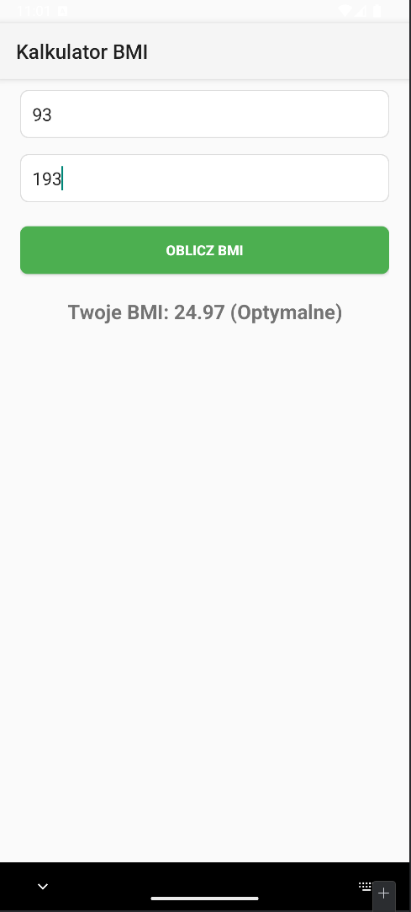

# Kalkulator BMI

Prosta aplikacja mobilna na Androida do obliczania wskaźnika masy ciała (BMI).

## Autor
Szymon Rosztajn, s25323

## Opis
Aplikacja pozwala użytkownikowi wprowadzić swoją wagę w kilogramach i wzrost w centymetrach, a następnie oblicza BMI oraz wyświetla odpowiednią kategorię wagową.

## Screenshot

